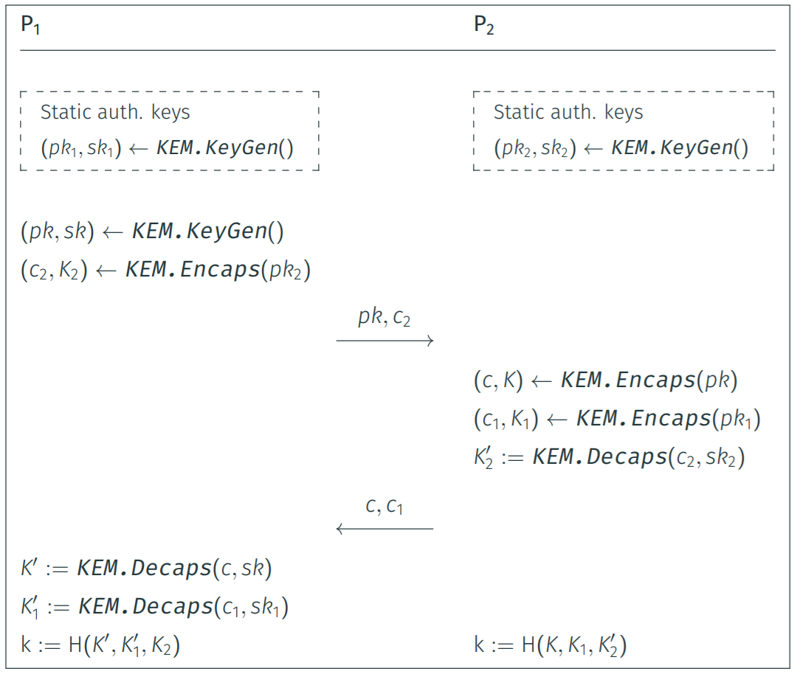

# PQC Demos

## Demo 1 (`1-demo-liboqs`)

This demo implements the following key-exchange protocol with [`liboqs`](https://github.com/open-quantum-safe/liboqs).



### How to build

1. Compile `liboqs`.

```bash
cd liboqs && mkdir -p build && cd build
cmake -GNinja ..
ninja
cd ../../1-demo-liboqs
```

2. Compile `demo-liboqs.c`.

```bash
gcc -I../liboqs/build/include -L../liboqs/build/lib demo-liboqs.c -o demo-liboqs -loqs -lcrypto -pthread
```

3. Run `demo-liboqs`.

```bash
./demo-liboqs
```
<details>
<summary>View example (click to expand)</summary>

```
[--] Selected KEM: ML-KEM-1024

[P1] Generating static keys...
[P1] pk1 (1568 bytes): 4d70765d4b3802288c46a49b2f6047c0...8a6c9a892d07efa9ab87b07a7544f1ca
[P1] sk1 (3168 bytes): 5189acae586bcd47a9dc46891cd2894b...07b9ac2186b4bb38656de633f44fd68b

[P2] Generating static keys...
[P2] pk2 (1568 bytes): ea50173c43587736b4b760aa4c0bcbdc...f2231573959382913e77bfcedbf73729
[P2] sk2 (3168 bytes): 3d0ac831a76aaec24594773fc3b6828c...b0167d388aeed9ca4bb9835f850c2e25

[P1] Generating ephemeral pk and sk...
[P1] pk (1568 bytes): 13da9dd0b96aaafab6e4020fc141578e...6a774c6fbe46dba891a783ff00a4e50d
[P1] sk (3168 bytes): 32a4488f51869e6258802871aa388757...3488dd6d84b242e22b6c34f88583d131
[P1] Generating encapsulation...
[P1] c2 (1568 bytes): 7c7b667fb9145a692dd6cf44d54a0e8d...a1911153190a9e4d20ca89f0adc6f51b
[P1] k2 (32 bytes): 512b9d7d264d8f69da5f40d9766c50f81b07ed9a6ff890c34baa459c60e082eb
[P1] Sending pk and c2 to P2...

[P2] Generating encapsulation...
[P2] c (1568 bytes): ae384d6317bb175a09c025f1cd8514cb...0830133c20cd4bc8ef2b2fb73c668c30
[P2] k (32 bytes): f50f307c99f7aa119b601105882ea285b4da50aec6823ca4f863d63843694cc6
[P2] Generating encapsulation...
[P2] c1 (1568 bytes): 390e2d8fe16e5240a7f89e28a6395d28...555e6716f186d67514a9fcc471158d9d
[P2] k1 (32 bytes): 317fe0cec8bcd21ec2dc04f40b841a53bbcd58a91c9d48892b89df0eca750cb3
[P2] Generating decapsulation...
[P2] k2_prime (32 bytes): 512b9d7d264d8f69da5f40d9766c50f81b07ed9a6ff890c34baa459c60e082eb
[P2] Sending c and c1 to P1...

[P1] Generating decapsulation...
[P1] k_prime (32 bytes): f50f307c99f7aa119b601105882ea285b4da50aec6823ca4f863d63843694cc6
[P1] Generating decapsulation...
[P1] k1_prime (32 bytes): 317fe0cec8bcd21ec2dc04f40b841a53bbcd58a91c9d48892b89df0eca750cb3

[P1] shared key: ceafc8c0b82344e1fc203ab956862fc090e56e178b1b987dab4213fa3d0d9eab
[P2] shared key: ceafc8c0b82344e1fc203ab956862fc090e56e178b1b987dab4213fa3d0d9eab
[--] Key exchange successful!
```    
</details>


## Demo 2 (`2-demo-liboqs-python`)

This demo implements the following hybrid signature scheme with [`liboqs-python`](https://github.com/open-quantum-safe/liboqs).

### How to build

1. Compile `liboqs` (requires shared library).

```bash
cd liboqs && mkdir -p build-shared && cd build-shared
cmake -GNinja .. -DBUILD_SHARED_LIBS=ON
ninja
sudo ninja install
cd ../../2-demo-liboqs-python
```

2. Set the `LD_LIBRARY_PATH` environment variable to point to the path to `liboqs` library directory.

```bash
export LD_LIBRARY_PATH=$LD_LIBRARY_PATH:/usr/local/lib
```

3. Install and activate virtualenv for Python

```bash
python3 -m venv venv
. venv/bin/activate
```

4. Install `liboqs-python`.

```bash
cd ../liboqs-python
pip install .
```

4. Check if `liboqs-python` works properly.

```bash
python3 examples/sig.py
```

<details>
<summary>View output (click to expand)</summary>

```
liboqs version: 0.12.0
liboqs-python version: 0.12.0
Enabled signature mechanisms:
['Dilithium2', 'Dilithium3', 'Dilithium5', 'ML-DSA-44', 'ML-DSA-65',
 'ML-DSA-87', 'Falcon-512', 'Falcon-1024', 'Falcon-padded-512',
 'Falcon-padded-1024', 'SPHINCS+-SHA2-128f-simple', 'SPHINCS+-SHA2-128s-simple',
 'SPHINCS+-SHA2-192f-simple', 'SPHINCS+-SHA2-192s-simple',
 'SPHINCS+-SHA2-256f-simple', 'SPHINCS+-SHA2-256s-simple',
 'SPHINCS+-SHAKE-128f-simple', 'SPHINCS+-SHAKE-128s-simple',
 'SPHINCS+-SHAKE-192f-simple', 'SPHINCS+-SHAKE-192s-simple',
 'SPHINCS+-SHAKE-256f-simple', 'SPHINCS+-SHAKE-256s-simple', 'MAYO-1', 'MAYO-2',
 'MAYO-3', 'MAYO-5', 'cross-rsdp-128-balanced', 'cross-rsdp-128-fast',
 'cross-rsdp-128-small', 'cross-rsdp-192-balanced', 'cross-rsdp-192-fast',
 'cross-rsdp-192-small', 'cross-rsdp-256-balanced', 'cross-rsdp-256-fast',
 'cross-rsdp-256-small', 'cross-rsdpg-128-balanced', 'cross-rsdpg-128-fast',
 'cross-rsdpg-128-small', 'cross-rsdpg-192-balanced', 'cross-rsdpg-192-fast',
 'cross-rsdpg-192-small', 'cross-rsdpg-256-balanced', 'cross-rsdpg-256-fast',
 'cross-rsdpg-256-small']

Signature details:
{'claimed_nist_level': 2,
 'is_euf_cma': True,
 'length_public_key': 1312,
 'length_secret_key': 2560,
 'length_signature': 2420,
 'name': 'ML-DSA-44',
 'sig_with_ctx_support': True,
 'version': 'FIPS204'}

Valid signature? True
```
</details>

5. Install `pypa/cryptography`.

```bash
pip install cryptography==44.0.0
```

6. Run Python script with hybrid signature scheme.

```bash
cd ../2-demo-liboqs-python
python3 hybrid-signature.py
```

<details>
<summary>View output (click to expand)</summary>

```bash
[KEYGEN] Generating keypairs...
[KEYGEN] Generating keyapir for ML-DSA-87...
[KEYGEN] pkPQC (2592 bytes): 583940f87c3271b7bb722dde0eb9d6e2...795c025b1ccbd7d61ad4f8d15f3f0ebb
[KEYGEN] skPQC (4896 bytes): 583940f87c3271b7bb722dde0eb9d6e2...385e0bd69dfcf1dced67bd1a44bf1184
[KEYGEN] Generating keyapir for Ed448...
[KEYGEN] pkT (57 bytes): e84546ddaf7cc8b1afa5468962e831ecdeea3c34c0413bd32e64aadbdac74b412dc251b5477c0a542f58a2f04cfa0f984be40e974b7c6d0c00
[KEYGEN] skT (57 bytes): dc45bdd038c758807a5af769852b750666c27eabf4c95020d0fa29679c8f60f710d2d0cdbd8ef7e24d1bd547fb4c99b05359ff5a2e4afdca58

[SIGN] Signing message "An important message to sign" with both signature schemes...
[SIGN] Signing message "An important message to sign" with ML-DSA-87...
[SIGN] sigPQC (4627 bytes): 4ddc7dde7d44545446d715f69fa669a1...0000000000000000020c12171c23292f
[SIGN] Signing message "An important message to sign" with Ed448...
[SIGN] sigT (114 bytes): f9be244ffb3a7360693f02d2fc28cade...ab73515355f9ceb47796b519b26b0c00
[SIGN] Hybrid signature is sigPQC || sigT

[VERIFY] Verifying signatures...
[VERIFY] The hybrid signature is valid
[VERIFY] if and only if both signatures are valid
[VERIFY] Verifying signature with ML-DSA-87...
[VERIFY] Is signature valid for ML-DSA-87?: True
[VERIFY] Verifying signature with Ed448...
[VERIFY] Is signature valid for Ed448?: True
[VERIFY] Hybrid signature is valid iff both
[VERIFY] signatures are valid
[VERIFY] Is hybrid signature valid?: True
```
</details>


## Demo 3 (`3-demo-oqs-curl`)

This demo connects `curl` to [Open Quantum Safe test server](https://test.openquantumsafe.org).

> [!NOTE]
> This demo requires [Docker](https://www.docker.com/).

```bash
cd 3-demo-oqs-curl
```

```bash
# ML-KEM-768
docker run -v `pwd`:/ca -it openquantumsafe/curl curl --cacert /ca/CA.crt --curves mlkem768 https://test.openquantumsafe.org:6020
```

<details>
<summary>View output (click to expand)</summary>

```bash
<!DOCTYPE html>
<html>
<head>
<title>Open Quantum Safe interop test server for quantum-safe cryptography</title>
</head>
<body>
<h1 align=center>
Successfully connected using
ecdsap256-mlkem768!
</h1>

Client-side KEM algorithm(s) indicated:
mlkem768
</body>
</html>
```
</details>

```bash
# X25519-ML-KEM-768
docker run -v `pwd`:/ca -it openquantumsafe/curl curl --cacert /ca/CA.crt --curves X25519MLKEM768 https://test.openquantumsafe.org:6002
```

<details>
<summary>View output (click to expand)</summary>

```bash
<!DOCTYPE html>
<html>
<head>
<title>Open Quantum Safe interop test server for quantum-safe cryptography</title>
</head>
<body>
<h1 align=center>
Successfully connected using
ecdsap256-X25519MLKEM768!
</h1>

Client-side KEM algorithm(s) indicated:
X25519MLKEM768
</body>
</html>
```
</details>

```bash
# SecP256r1-MLKEM-768
docker run -v `pwd`:/ca -it openquantumsafe/curl curl --cacert /ca/CA.crt --curves SecP256r1MLKEM768 https://test.openquantumsafe.org:6001
```

<details>
<summary>View output (click to expand)</summary>

```bash
<!DOCTYPE html>
<html>
<head>
<title>Open Quantum Safe interop test server for quantum-safe cryptography</title>
</head>
<body>
<h1 align=center>
Successfully connected using
ecdsap256-SecP256r1MLKEM768!
</h1>

Client-side KEM algorithm(s) indicated:
SecP256r1MLKEM768
</body>
</html>
```
</details>

```bash
docker run -it openquantumsafe/curl openssl speed
```

<details>
<summary>View output (click to expand)</summary>

```bash
```
</details>

## Demo 4 (`4-demo-tls13`)

TODO

```bash
chrome://flags
#enable-tls13-kyber
https://pq.cloudflareresearch.com
https://test.openquantumsafe.org:6041
https://test.openquantumsafe.org:6084/
```
