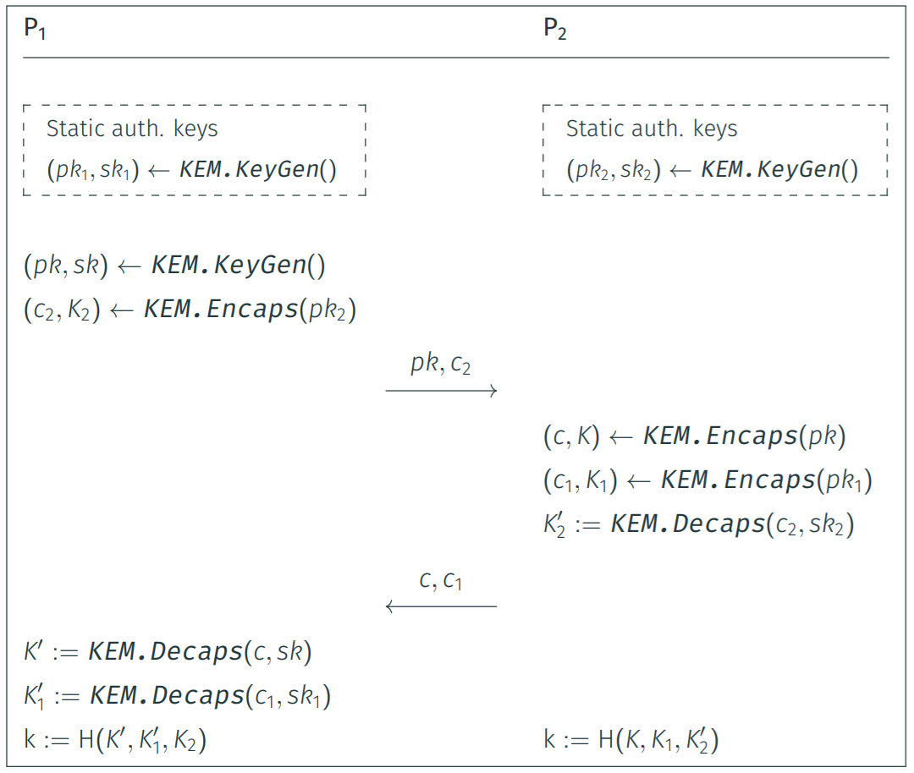

# Demo LibOQS

This demo implements the following key-exchange protocol with [`liboqs`](https://github.com/open-quantum-safe/liboqs).



## How to build

1. Compile `liboqs`.

```bash
make liboqs
```

2. Compile `demo-liboqs.c`.

```bash
make demo
```

3. Run `demo-liboqs` with `ML-KEM-1024`.

```bash
make run kem=ML-KEM-1024
```
<details>
<summary>View example (click to expand)</summary>

```
[--] Selected KEM: ML-KEM-1024

[P1] Generating static keys...
[P1] pk1 (1568 bytes): 4d70765d4b3802288c46a49b2f6047c0...8a6c9a892d07efa9ab87b07a7544f1ca
[P1] sk1 (3168 bytes): 5189acae586bcd47a9dc46891cd2894b...07b9ac2186b4bb38656de633f44fd68b

[P2] Generating static keys...
[P2] pk2 (1568 bytes): ea50173c43587736b4b760aa4c0bcbdc...f2231573959382913e77bfcedbf73729
[P2] sk2 (3168 bytes): 3d0ac831a76aaec24594773fc3b6828c...b0167d388aeed9ca4bb9835f850c2e25

[P1] Generating ephemeral pk and sk...
[P1] pk (1568 bytes): 13da9dd0b96aaafab6e4020fc141578e...6a774c6fbe46dba891a783ff00a4e50d
[P1] sk (3168 bytes): 32a4488f51869e6258802871aa388757...3488dd6d84b242e22b6c34f88583d131
[P1] Generating encapsulation...
[P1] c2 (1568 bytes): 7c7b667fb9145a692dd6cf44d54a0e8d...a1911153190a9e4d20ca89f0adc6f51b
[P1] k2 (32 bytes): 512b9d7d264d8f69da5f40d9766c50f81b07ed9a6ff890c34baa459c60e082eb
[P1] Sending pk and c2 to P2...

[P2] Generating encapsulation...
[P2] c (1568 bytes): ae384d6317bb175a09c025f1cd8514cb...0830133c20cd4bc8ef2b2fb73c668c30
[P2] k (32 bytes): f50f307c99f7aa119b601105882ea285b4da50aec6823ca4f863d63843694cc6
[P2] Generating encapsulation...
[P2] c1 (1568 bytes): 390e2d8fe16e5240a7f89e28a6395d28...555e6716f186d67514a9fcc471158d9d
[P2] k1 (32 bytes): 317fe0cec8bcd21ec2dc04f40b841a53bbcd58a91c9d48892b89df0eca750cb3
[P2] Generating decapsulation...
[P2] k2_prime (32 bytes): 512b9d7d264d8f69da5f40d9766c50f81b07ed9a6ff890c34baa459c60e082eb
[P2] Sending c and c1 to P1...

[P1] Generating decapsulation...
[P1] k_prime (32 bytes): f50f307c99f7aa119b601105882ea285b4da50aec6823ca4f863d63843694cc6
[P1] Generating decapsulation...
[P1] k1_prime (32 bytes): 317fe0cec8bcd21ec2dc04f40b841a53bbcd58a91c9d48892b89df0eca750cb3

[P1] shared key: ceafc8c0b82344e1fc203ab956862fc090e56e178b1b987dab4213fa3d0d9eab
[P2] shared key: ceafc8c0b82344e1fc203ab956862fc090e56e178b1b987dab4213fa3d0d9eab
[--] Key exchange successful!
```    
</details>

3. Run `demo-liboqs` with `HQC-256`.

```bash
make run kem=HQC-256
```

<details>
<summary>View example (click to expand)</summary>

```
[--] Selected KEM: HQC-256

[P1] Generating static keys...
[P1] pk1 (7245 bytes): fca425790417bfede58901dac2e32113...bc02e31770aff70407fa65ebb6331507
[P1] sk1 (7317 bytes): 7994d90d04cc96f01654915a680c7479...bc02e31770aff70407fa65ebb6331507

[P2] Generating static keys...
[P2] pk2 (7245 bytes): e9196ee6b438edb0c61c181ca6e8f822...e37364af32bff2cb1eabd892d7c25d06
[P2] sk2 (7317 bytes): 1d465976853158b629e0b6f09cf370d8...e37364af32bff2cb1eabd892d7c25d06

[P1] Generating ephemeral pk and sk...
[P1] pk (7245 bytes): dd0e539dd33327aa2090f6d4416a66c2...5fc57fb11be632aad963f9ac1aa84a15
[P1] sk (7317 bytes): be1ce8bcaab20fc01d777db4b537b6ab...5fc57fb11be632aad963f9ac1aa84a15
[P1] Generating encapsulation...
[P1] c2 (14421 bytes): b9b35bcc2fe233c588535d087b2d151d...4ab430f486f050aedb68c9fdf61aab2d
[P1] k2 (64 bytes): 326dc74aea1b1db052464d864379568b785bac0d6bbc3ece020a35255a870bece89e3c409e7de5af704d2fba6442305f500fdc0825258de15534c7e3a56a371f
[P1] Sending pk and c2 to P2...

[P2] Generating encapsulation...
[P2] c (14421 bytes): aa6229996e333558cf9ee632da445b17...3bb069595f9198f51c3439fc9ffb0b83
[P2] k (64 bytes): feefe84ebf441ae296f672697aa6089f9c59bdff8e609283bc5b7b429f557f60130de7b92ee8087acdb5670d34f86f28204e104e59064127e4a10628f703b137
[P2] Generating encapsulation...
[P2] c1 (14421 bytes): 64c2b7ad5dcd7d6cd76023ee57144162...cfae94b12fb793f17a82c37e9255cc3f
[P2] k1 (64 bytes): 7ad653a4313bd84d79c46fe57cc26563bddcbfb24a2ddc91a7ed9043efab6efb820181cbf6b66e94f55ef0b0d1a83e7f8f2a3efdb82e649911ab3ed7607768af
[P2] Generating decapsulation...
[P2] k2_prime (64 bytes): 326dc74aea1b1db052464d864379568b785bac0d6bbc3ece020a35255a870bece89e3c409e7de5af704d2fba6442305f500fdc0825258de15534c7e3a56a371f
[P2] Sending c and c1 to P1...

[P1] Generating decapsulation...
[P1] k_prime (64 bytes): feefe84ebf441ae296f672697aa6089f9c59bdff8e609283bc5b7b429f557f60130de7b92ee8087acdb5670d34f86f28204e104e59064127e4a10628f703b137
[P1] Generating decapsulation...
[P1] k1_prime (64 bytes): 7ad653a4313bd84d79c46fe57cc26563bddcbfb24a2ddc91a7ed9043efab6efb820181cbf6b66e94f55ef0b0d1a83e7f8f2a3efdb82e649911ab3ed7607768af

[P1] shared key: b35b3ab4cb28093be4a5b4ad9ecb3164947765a2c8bff9988a0d704239de86c1
[P2] shared key: b35b3ab4cb28093be4a5b4ad9ecb3164947765a2c8bff9988a0d704239de86c1
[--] Key exchange successful!
```    
</details>