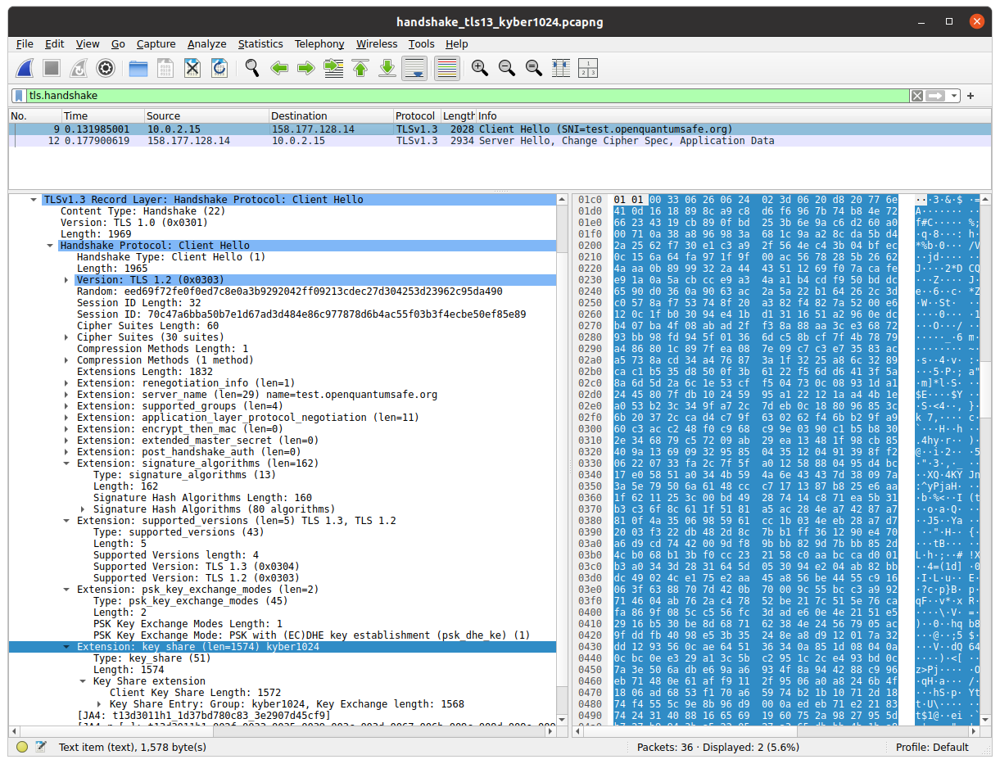
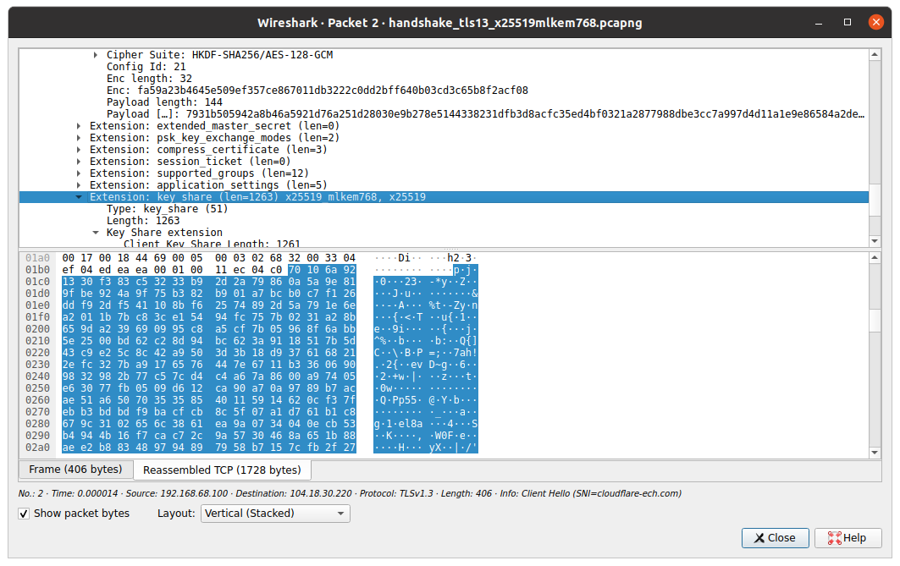

# Demo OQS-Wireshark

This demo shows how to use [OQS-Wireshark](https://github.com/open-quantum-safe/oqs-demos/blob/main/wireshark/README.md).

> [!NOTE]
> This demo requires [Docker](https://www.docker.com/).

1. Allow Docker to access the display.

```bash
xhost +
export DISPLAY=:0
```

2. Run OQS-Wireshark with Docker.

```bash
docker run --rm -it --net=host -e DISPLAY=$DISPLAY -v /tmp/.X11-unix:/tmp/.X11-unix -v `pwd`:/root/captures openquantumsafe/wireshark
```

3. Open file `handshake_tls13_kyber1024.pcapng`.

4. Filter by `tls.handshake`.

5. Expand package `Client Hello`.

6. Search for `Extension: key_share`.



7. Repeat with `handshake_tls13_x25519mlkem768.pcapng`.


