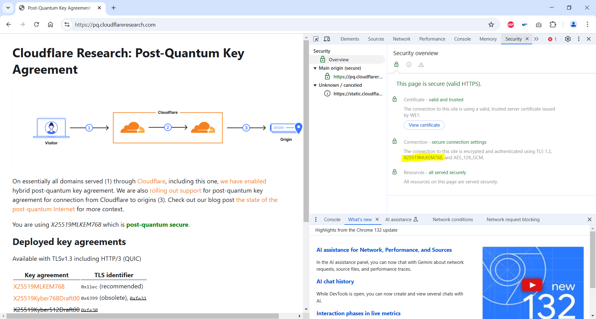
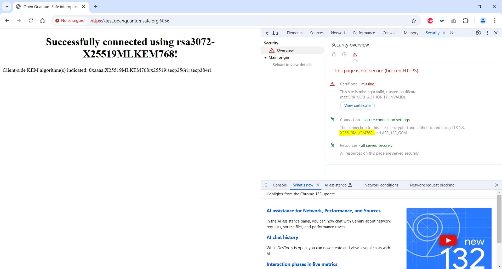
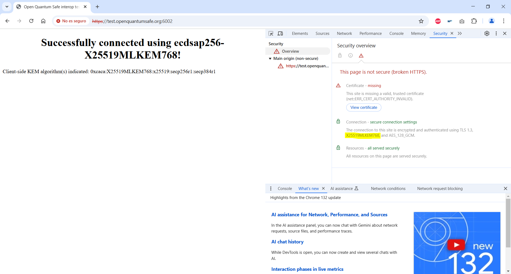

# Demo TLS 1.3

This demo shows how to visualize if post-quantum TLS is used by browser.

1. Open Google Chrome (it also works with Firefox).

2. Go to https://pq.cloudflareresearch.com

3. Open DevTools.

4. Go to Security tab.

5. Look for `X25519MLKEM768`.

6. Repeat with https://test.openquantumsafe.org:6056/

7. Repeat with https://test.openquantumsafe.org:6002.

